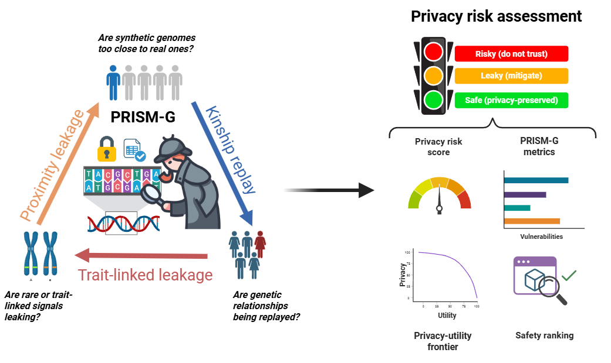

# PRISM-G: Privacy Risk Integrated Score For Multi-Representation Genomes

  

**PRISM-G** is an interpretable framework for evaluating the privacy risk of synthetic genomic data (artificial genotype datasets). It quantifies privacy exposure by comparing real and synthetic genotypes across three complementary components:

- **Proximity Leakage (PLI)**: Measures whether synthetic samples are unusually close to real individuals in genetic coordinate space, indicating potential identity leakage.
- **Kinship Replay (KRI)**: Detects whether patterns of genetic relatedness present in the original data, such as kinship or haplotype sharing, have been unintentionally reproduced.
- **Trait-Linked Leakage (TLI)**: Evaluates whether rare variant signals are preserved and whether they can distinguish individuals whose genomes were used to generate the synthetic data.

These components are combined into a calibrated **PRISM-G score (0–100)** that summarizes the overall privacy risk while preserving interpretability through its individual component scores.

PRISM-G is a model-agnostic framework that can be used to evaluate the privacy exposure of different classes of synthetic genome generators. Furthermore, when combined with a utility metric for a specific downstream task, it enables the construction of a privacy–utility Pareto frontier, facilitating systematic comparison of generative models and their trade-offs between privacy protection and analytical utility.

---

## Citation

If you use PRISM-G in your work, you can cite:

> Alejandro Correa Rojo, Yves Moreau, Gökhan Ertaylan, PRISM-G: an interpretable privacy scoring framework for assessing risk in synthetic human genome data, *Bioinformatics*, Volume XX, Issue XX, August XX, Pages XX-XX, https://doi.org/10.1093/bioinformatics/btag377.  